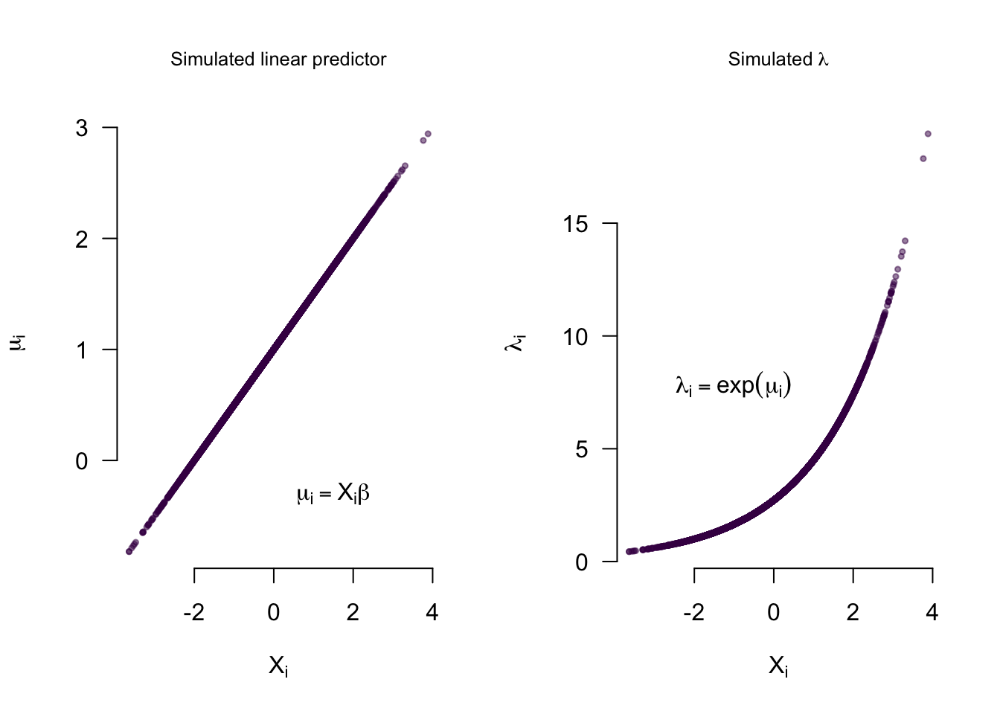
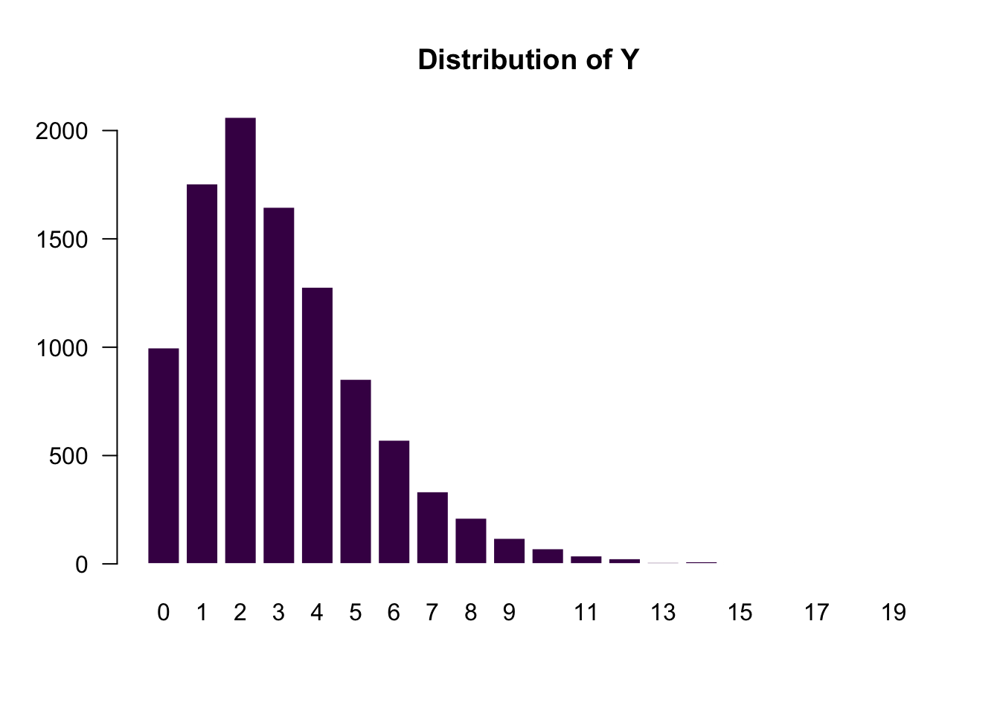
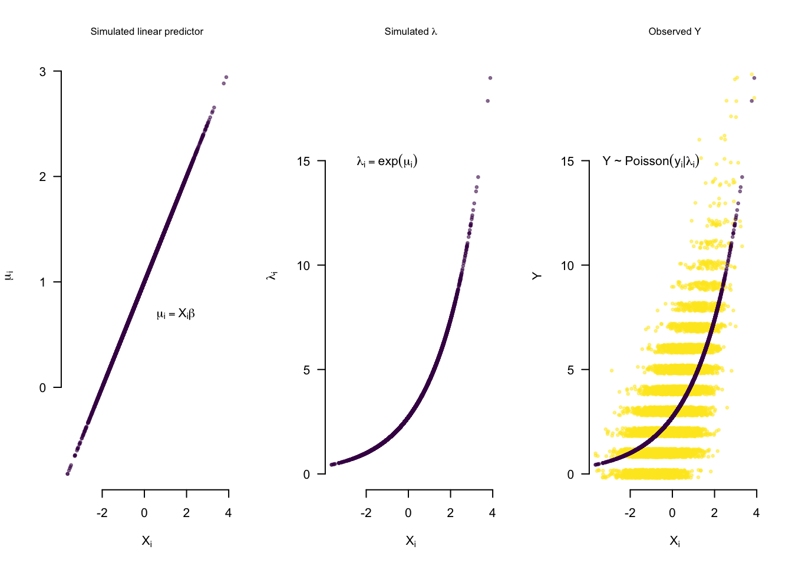
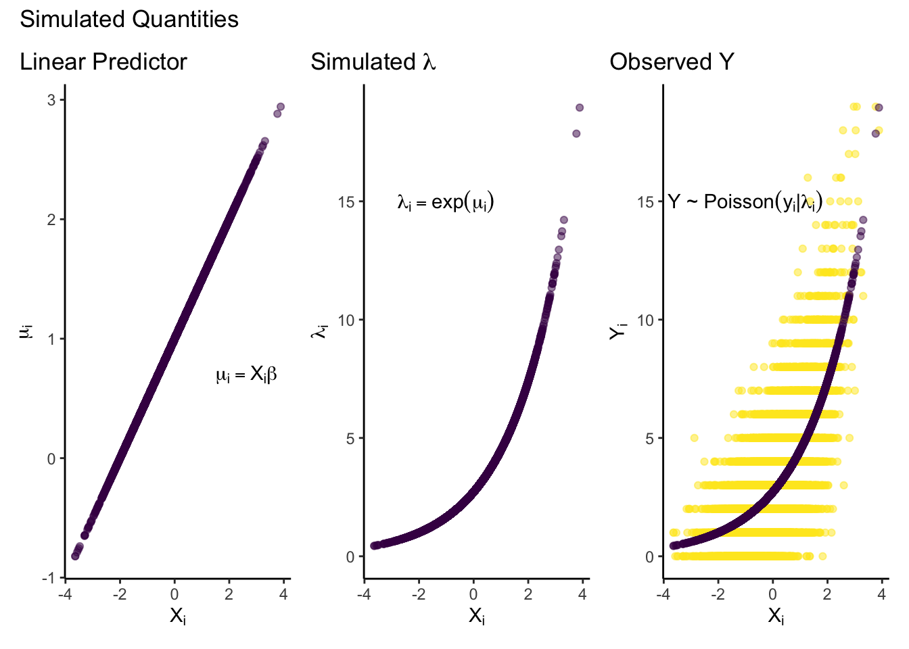
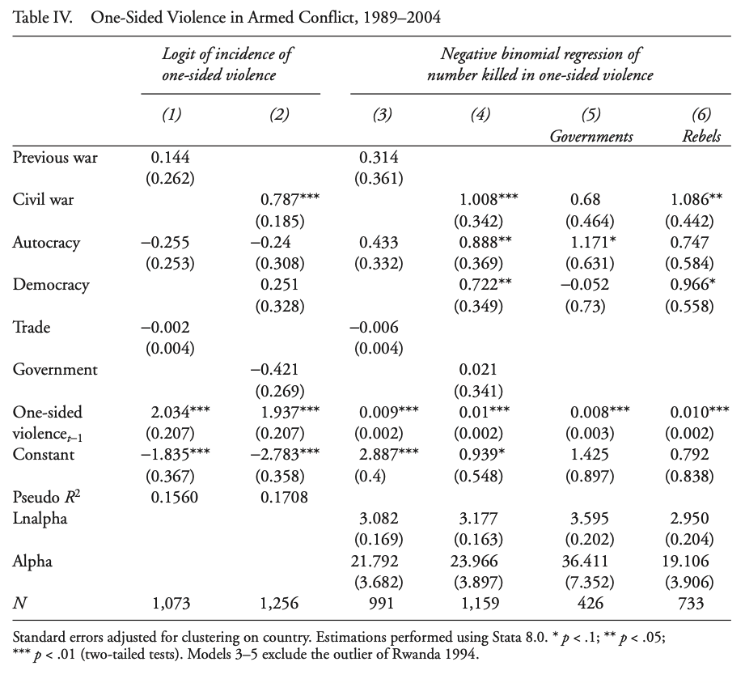
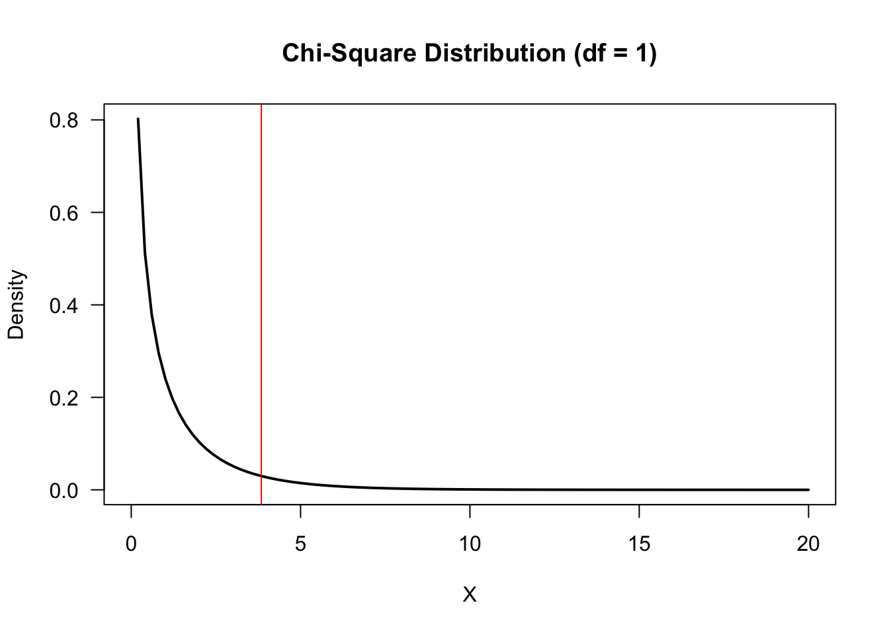
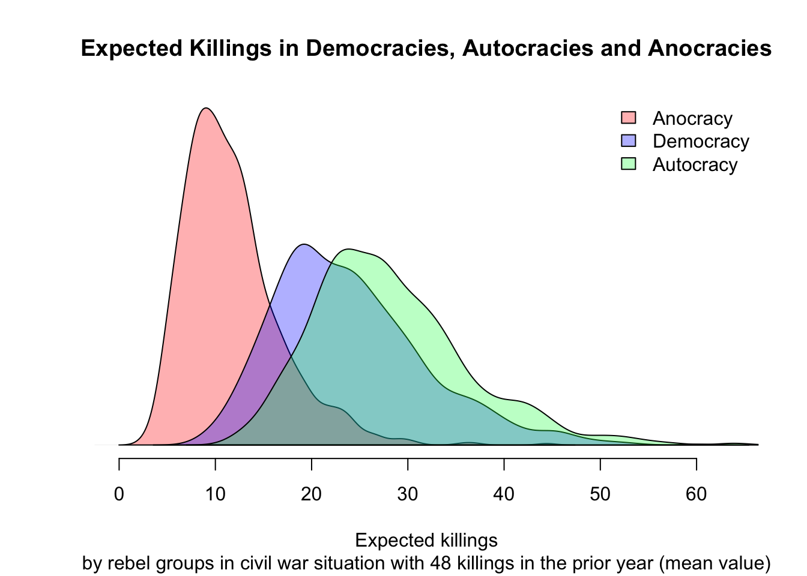
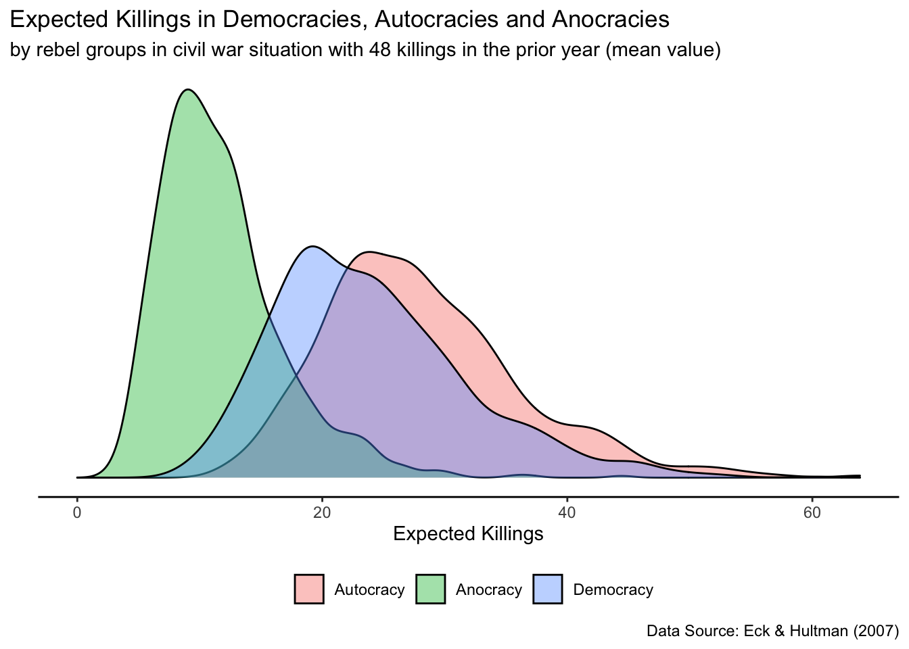
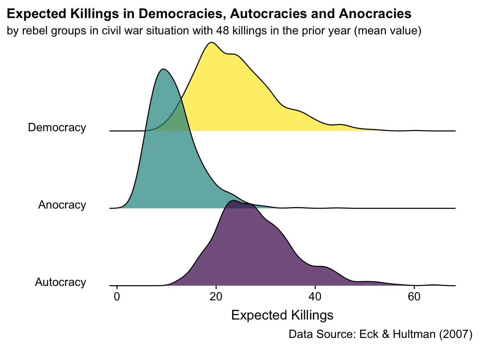

------------------------------------------------------------------------

## Today we will learn: {.unnumbered}

1.  MLE: Poisson Regression
2.  Poisson and Negative Binomial in GLM
3.  Likelihood Ratio Test (Overdispersion)
4.  Expected Values

In other words, the goals are to:

-   Implement MLE for count models
-   Use count models with GLM
-   Compute meaningful quantities of interest

------------------------------------------------------------------------


```r
# The first line sets an option for the final document that can be produced from
# the .Rmd file. Don't worry about it.
knitr::opts_chunk$set(echo = TRUE,
                      collapse = TRUE,
                      out.width="\\textwidth", # for larger figures 
                      attr.output = 'style="max-height: 200px"',
                      tidy = 'styler' # styles the code in the output
                      )

# The next bit is quite powerful and useful. 
# First you define which packages you need for your analysis and assign it to 
# the p_needed object. 
p_needed <-
  c("ggplot2", "viridis", "MASS", "optimx", "scales", "foreign", 
    "patchwork", "stargazer", "vcd", "ggridges")

# Now you check which packages are already installed on your computer.
# The function installed.packages() returns a vector with all the installed 
# packages.
packages <- rownames(installed.packages())
# Then you check which of the packages you need are not installed on your 
# computer yet. Essentially you compare the vector p_needed with the vector
# packages. The result of this comparison is assigned to p_to_install.
p_to_install <- p_needed[!(p_needed %in% packages)]
# If at least one element is in p_to_install you then install those missing
# packages.
if (length(p_to_install) > 0) {
  install.packages(p_to_install)
}
# Now that all packages are installed on the computer, you can load them for
# this project. Additionally the expression returns whether the packages were
# successfully loaded.
sapply(p_needed, require, character.only = TRUE)

# This is an option for stargazer tables
# It automatically adapts the output to html or latex,
# depending on whether we want a html or pdf file
stargazer_opt <- ifelse(knitr::is_latex_output(), "latex", "html")

# Don't worry about this part: it ensures that if the file is knitted to html,
# significance notes are depicted correctly
if (stargazer_opt == "html"){
  fargs <- formals(stargazer)
  fargs$notes.append = FALSE
  fargs$notes = c("<sup>&sstarf;</sup>p<0.1; <sup>&sstarf;&sstarf;</sup>p<0.05; <sup>&sstarf;&sstarf;&sstarf;</sup>p<0.01")
  formals(stargazer) <- fargs
}

# only relevant for ggplot2 plotting
# setting a global ggplot theme for the entire document to avoid 
# setting this individually for each plot 
theme_set(theme_classic() + # start with classic theme 
  theme(
    plot.background = element_blank(),# remove all background 
    plot.title.position = "plot", # move the plot title start slightly 
    legend.position = "bottom" # by default, put legend on the bottom
  ))
```


# MLE: Poisson Regression {.tabset}

What first?
We start with some fake data...

We need a population (here 10000 observations).


```r
n <- 10000

# We set true parameters for \beta_0 and \beta_1

beta0 <- 1
beta1 <- 0.5

# and generate an independent variable X
set.seed(2022)
X <- rnorm(n, 0, 1)
```

Now we can generate `lambda` (aka $\lambda$ on slide 13) via the *exponential response function*:

$$
\lambda_i = \exp(X_i\beta) = \exp(\mu_i) \Rightarrow \lambda_i > 0
$$

Here `mu` is the linear predictor.
As with logit and probit models last week, we need to transform the linear predictor, but this time with a different response function (in other words, our model uses a different *link function*).
The *exponential response function* (aka exponential inverse link function) ensures that for any value of $X$ and $\beta$, the systematic component is reparameterized to be greater than 0.


```r
exp_resp <- function(beta0, beta1, X) {
  lambda <- exp(beta0 + beta1 * X)
  return(lambda)
}

lambda <- exp_resp(
  beta0 = beta0,
  beta1 = beta1,
  X = X
)
```

Let's quickly plot what we just did:


```r
par(mfrow = c(1, 2), las = 1)

# Systematic component: linear predictor
plot(
  x = X,
  y = beta0 + beta1 * X,
  pch = 19,
  cex = 0.5,
  col = viridis(1, 0.5),
  main = "Simulated linear predictor",
  font.main = 1,
  cex.main = 0.8,
  ylab = expression(mu[i]),
  xlab = expression(X[i]),
  bty = "n"
)
text(
  x = 1.5,
  y = -0.3,
  labels = expression(mu[i] == X[i] * beta)
)

# Systematic component: lambda
plot(
  x = X,
  y = lambda,
  pch = 19,
  cex = 0.5,
  col = viridis(1, 0.5),
  main = expression(paste("Simulated ", lambda)),
  font.main = 1,
  cex.main = 0.8,
  ylab = expression(lambda[i]),
  xlab = expression(X[i]),
  bty = "n"
)
text(
  x = -1,
  y = 7.85,
  labels = expression(lambda[i] == exp(mu[i]))
)
```



Finally, we can get Y from the underlying *Poisson* distribution.
Remember that it only has one parameter $\lambda$, so-called shape parameter, which defines both the center and the spread of the values.
Remember `r`, `d`, `q`, `p`?


```r
par(las = 1)

Y <- rpois(n, lambda)

summary(Y)
##    Min. 1st Qu.  Median    Mean 3rd Qu.    Max. 
##    0.00    1.00    3.00    3.07    4.00   19.00
barplot(table(factor(Y, levels = min(Y):max(Y))), # add 0 for skipped values
  col = viridis(1),
  border = FALSE,
  main = "Distribution of Y"
)
```



Let's add this step to the plot above:

## Base R {.unnumbered}


```r
par(mfrow = c(1, 3), las = 1)

# Systematic component: linear predictor
plot(
  x = X,
  y = beta0 + beta1 * X,
  pch = 19,
  cex = 0.5,
  col = viridis(1, 0.5),
  main = "Simulated linear predictor",
  font.main = 1,
  cex.main = 0.8,
  ylab = expression(mu[i]),
  xlab = expression(X[i]),
  bty = "n"
)
text(
  x = 1.5,
  y = 0.7,
  labels = expression(mu[i] == X[i] * beta)
)

# Systematic component: lambda
plot(
  x = X,
  y = lambda,
  pch = 19,
  cex = 0.5,
  col = viridis(1, 0.5),
  main = expression(paste("Simulated ", lambda)),
  font.main = 1,
  cex.main = 0.8,
  ylab = expression(lambda[i]),
  xlab = expression(X[i]),
  ylim = range(Y),
  bty = "n"
)
text(
  x = -1,
  y = 15,
  labels = expression(lambda[i] == exp(mu[i]))
)

# observed values
plot(
  x = X,
  y = jitter(Y),
  pch = 19,
  cex = 0.5,
  col = viridis(2, 0.5)[2],
  main = "Observed Y",
  font.main = 1,
  cex.main = 0.8,
  ylab = "Y",
  xlab = expression(X[i]),
  ylim = range(Y),
  bty = "n"
)
points(
  x = X,
  y = lambda,
  pch = 19,
  cex = 0.5,
  col = viridis(2, 0.5)[1]
)
text(
  x = -1,
  y = 15,
  labels = expression(paste("Y ~ Poisson", (y[i] * "|" * lambda[i])))
)
```



## ggplot2 {.unnumbered}


```r
# Systematic component: LP
syst <- ggplot() +
  geom_point(aes(x = X, y = beta0 + beta1 * X),
    color = viridis(1, 0.5)
  ) +
  labs(
    x = expression(X[i]),
    y = expression(mu[i]),
    title = "Linear Predictor"
  ) +
  annotate("text",
    label = expression(mu[i] == X[i] * beta),
    x = 1.5, y = 0.7,
    hjust = 0
  )

# Systematic component: Lambda
syst2 <- ggplot() +
  geom_point(aes(x = X, y = lambda),
    color = viridis(1, 0.5)
  ) +
  labs(
    x = expression(X[i]),
    y = expression(lambda[i]),
    title = expression(paste("Simulated ", lambda))
  ) +
  annotate("text",
    label = expression(lambda[i] == exp(mu[i])),
    x = -1, y = 15
  ) +
  ylim(range(Y))

yhat <- ggplot() +
  geom_point(aes(x = X, y = Y), color = viridis(2, 0.5)[2]) +
  geom_point(aes(x = X, y = lambda), color = viridis(2, 0.5)[1]) +
  labs(
    x = expression(X[i]),
    y = expression(Y[i]),
    title = "Observed Y"
  ) +
  annotate("text",
    label = expression(paste("Y ~ Poisson", (y[i] * "|" * lambda[i]))),
    x = -1, y = 15
  )

syst + syst2 + yhat +
  plot_annotation(title = "Simulated Quantities") &
  scale_color_viridis(direction = -1) & theme(legend.position = "none")
```



# Poisson MLE

The Poisson probability function for a single observation $i$:

$$
f_{\text{Poisson}}(y_{i}|\lambda) = 
\begin{cases}
  \dfrac{e^{-\lambda}\lambda^{y_{i}}}{y_{i}!} & 
    \text{for } \lambda > 0\text{ and }y_{i}=0,\,1,\ldots\\
  0 & 
    \text{otherwise}
\end{cases}
$$

The probability density of all the data (i.e., $N$ observations, given that $Y_i$ and $Y_j$ are independent conditional on $X$ for all $i \neq j$ and identically distributed) is the product of all $N$ individual observations:

$$
\Pr(Y|\lambda) = \prod_{i=1}^{N} \frac{e^{-\lambda}\lambda^{y_{i}}}{y_{i}!} 
$$

From this, we can obtain the likelihood function.
But as usual, we prefer the (shortened) log-likelihood:

$$
\ln L(\lambda|Y)  \propto \sum_{i=1}^{n} (y_{i} ln(\lambda_i) - \lambda_i)
$$

Replacing $\lambda$ with the reparametrized linear predictor $\lambda = e^{\mu_i} = e^{X_{i}\beta}$ gives us the log-likelihood function of our model:

$$
\ln L(\beta|Y) \propto \sum_{i=1}^{n} (y_{i} X_{i}\beta -e^{X_{i}\beta})\\
$$

Now we can program the Poisson log-likelihood function (cf. slide 13):


```r
## Poisson MLE
# Log Likelihood
pois_ll <- function(X, Y, theta) {
  beta0 <- theta[1]
  beta1 <- theta[2]

  logl <- sum(Y * (beta0 + beta1 * X) - exp(beta0 + beta1 * X))
  return(logl)
}
```

As the linear predictor `mu` is reparameterized with `exp()`, we can again estimate `theta` unbounded, but ensure that counts will not be negative.

Find the MLE using `optimx`:


```r
# Starting Values
stval <- c(0, 0)

# Optimize
res <-
  optimx(
    stval,
    pois_ll,
    Y = Y,
    X = X,
    control = list(maximize = T)
  )
## Maximizing -- use negfn and neggr
## Warning in max(logpar): no non-missing arguments to max; returning -Inf
## Warning in min(logpar): no non-missing arguments to min; returning Inf
res # check results
##                   p1        p2    value fevals gevals niter convcode kkt1 kkt2
## Nelder-Mead 1.003715 0.4977509 7481.458     63     NA    NA        0 TRUE TRUE
## BFGS        1.003568 0.4977091 7481.459     52     10    NA        0 TRUE TRUE
##             xtime
## Nelder-Mead 0.012
## BFGS        0.018
```

> (How) Can we interpret those coefficients?

## Eck and Hultman 2007: One-sided violence against civilians {.unnumbered}

Load the `eck_rep.dta`, a replication dataset for @eck_hultman_2007.


```r
dta <- read.dta("raw-data/eck_rep.dta", convert.factors = FALSE)

#  Some data preparation
dta$os_best[dta$os_best == 500000] <- NA # Rwanda

# Omit NAs (as our log-likelihood can't handle missings)
dta2 <- na.omit(dta[, c("os_best", "auto")])
```

Let's estimate the effect of autocracy on one-sided violence via numerical maximization using `optimx`


```r
# Maximize log-likelihood function
res2 <-
  optimx(
    stval,
    pois_ll,
    Y = dta2$os_best,
    X = dta2$auto,
    control = list(maximize = T)
  )
## Maximizing -- use negfn and neggr
## Warning in max(logpar): no non-missing arguments to max; returning -Inf
## Warning in min(logpar): no non-missing arguments to min; returning Inf
res2
##                   p1        p2    value fevals gevals niter convcode kkt1 kkt2
## Nelder-Mead 3.518575 0.8180164 222639.1     79     NA    NA        0 TRUE TRUE
## BFGS        3.518528 0.8180535 222639.1     49      9    NA        0 TRUE TRUE
##             xtime
## Nelder-Mead 0.002
## BFGS        0.002
```

Find out how well we did.
Compare it with the built-in `glm` Poisson:


```r
m1 <- glm(os_best ~ auto, dta2, family = "poisson")

coef(m1)
## (Intercept)        auto 
##   3.5185279   0.8180535

# Compare to our likelihood function
res2
##                   p1        p2    value fevals gevals niter convcode kkt1 kkt2
## Nelder-Mead 3.518575 0.8180164 222639.1     79     NA    NA        0 TRUE TRUE
## BFGS        3.518528 0.8180535 222639.1     49      9    NA        0 TRUE TRUE
##             xtime
## Nelder-Mead 0.002
## BFGS        0.002
```

# Poisson and Negative Binomial in GLM

We are going to replicate model 4, p.243 in @eck_hultman_2007.




```r
# We start with a Poisson Model
m1 <- glm(
  os_best ~ intensity_dyad + auto + demo + govt + prior_os,
  data = dta,
  family = "poisson"
)
summary(m1)
```

```{style="max-height: 200px"}
## 
## Call:
## glm(formula = os_best ~ intensity_dyad + auto + demo + govt + 
##     prior_os, family = "poisson", data = dta)
## 
## Deviance Residuals: 
##     Min       1Q   Median       3Q      Max  
## -47.773  -10.585   -7.949   -6.797  251.959  
## 
## Coefficients:
##                  Estimate Std. Error z value Pr(>|z|)    
## (Intercept)     2.636e+00  1.795e-02 146.843   <2e-16 ***
## intensity_dyad  5.839e-01  8.373e-03  69.735   <2e-16 ***
## auto            8.058e-01  1.475e-02  54.632   <2e-16 ***
## demo            2.072e-01  1.655e-02  12.522   <2e-16 ***
## govt           -8.030e-02  8.274e-03  -9.705   <2e-16 ***
## prior_os        7.327e-04  4.365e-06 167.858   <2e-16 ***
## ---
## Signif. codes:  0 '***' 0.001 '**' 0.01 '*' 0.05 '.' 0.1 ' ' 1
## 
## (Dispersion parameter for poisson family taken to be 1)
## 
##     Null deviance: 344356  on 1158  degrees of freedom
## Residual deviance: 310136  on 1153  degrees of freedom
##   (116 observations deleted due to missingness)
## AIC: 311830
## 
## Number of Fisher Scoring iterations: 8
```

```r
# Negative Binomial Model
m2 <-
  glm.nb(
    os_best ~ intensity_dyad + auto + demo + govt + prior_os,
    data = dta,
    control = glm.control(maxit = 100)
  )
summary(m2)
```

```{style="max-height: 200px"}
## 
## Call:
## glm.nb(formula = os_best ~ intensity_dyad + auto + demo + govt + 
##     prior_os, data = dta, control = glm.control(maxit = 100), 
##     init.theta = 0.04172548365, link = log)
## 
## Deviance Residuals: 
##     Min       1Q   Median       3Q      Max  
## -1.8178  -0.7097  -0.7084  -0.6542   2.3510  
## 
## Coefficients:
##                 Estimate Std. Error z value Pr(>|z|)    
## (Intercept)    0.9389889  0.5644146   1.664  0.09618 .  
## intensity_dyad 1.0077767  0.3470595   2.904  0.00369 ** 
## auto           0.8881510  0.4187919   2.121  0.03394 *  
## demo           0.7217879  0.4512491   1.600  0.10970    
## govt           0.0209680  0.3011477   0.070  0.94449    
## prior_os       0.0095023  0.0005744  16.543  < 2e-16 ***
## ---
## Signif. codes:  0 '***' 0.001 '**' 0.01 '*' 0.05 '.' 0.1 ' ' 1
## 
## (Dispersion parameter for Negative Binomial(0.0417) family taken to be 1)
## 
##     Null deviance: 602.77  on 1158  degrees of freedom
## Residual deviance: 536.89  on 1153  degrees of freedom
##   (116 observations deleted due to missingness)
## AIC: 4687.4
## 
## Number of Fisher Scoring iterations: 1
## 
## 
##               Theta:  0.04173 
##           Std. Err.:  0.00286 
## 
##  2 x log-likelihood:  -4673.42500
```

```r
# control=glm.control(maxit=100) increases the number of maximum iterations
# increase it when you see the warning: "glm.fit: algorithm did not converge"
```

Make a nice looking Latex table of both models:


```r
stargazer(
  list(m1, m2),
  out = "table_lab.tex",
  title = "Regression Results",
  notes = "Excluding observation Rwanda 1994",
  intercept.bottom = TRUE,
  covariate.labels = c(
    "Civil War",
    "Autocracy",
    "Democracy",
    "Government",
    "One sided Violence t-1",
    "Constant"
  ),
  dep.var.labels = c("Number killed in one-sided violence"),
  table.placement = "H", # latex output, keep the figure at exactly Here in text
  type = stargazer_opt
)
```


<table style="text-align:center"><caption><strong>Regression Results</strong></caption>
<tr><td colspan="3" style="border-bottom: 1px solid black"></td></tr><tr><td style="text-align:left"></td><td colspan="2"><em>Dependent variable:</em></td></tr>
<tr><td></td><td colspan="2" style="border-bottom: 1px solid black"></td></tr>
<tr><td style="text-align:left"></td><td colspan="2">Number killed in one-sided violence</td></tr>
<tr><td style="text-align:left"></td><td><em>Poisson</em></td><td><em>negative</em></td></tr>
<tr><td style="text-align:left"></td><td><em></em></td><td><em>binomial</em></td></tr>
<tr><td style="text-align:left"></td><td>(1)</td><td>(2)</td></tr>
<tr><td colspan="3" style="border-bottom: 1px solid black"></td></tr><tr><td style="text-align:left">Civil War</td><td>0.584<sup>***</sup></td><td>1.008<sup>***</sup></td></tr>
<tr><td style="text-align:left"></td><td>(0.008)</td><td>(0.347)</td></tr>
<tr><td style="text-align:left"></td><td></td><td></td></tr>
<tr><td style="text-align:left">Autocracy</td><td>0.806<sup>***</sup></td><td>0.888<sup>**</sup></td></tr>
<tr><td style="text-align:left"></td><td>(0.015)</td><td>(0.419)</td></tr>
<tr><td style="text-align:left"></td><td></td><td></td></tr>
<tr><td style="text-align:left">Democracy</td><td>0.207<sup>***</sup></td><td>0.722</td></tr>
<tr><td style="text-align:left"></td><td>(0.017)</td><td>(0.451)</td></tr>
<tr><td style="text-align:left"></td><td></td><td></td></tr>
<tr><td style="text-align:left">Government</td><td>-0.080<sup>***</sup></td><td>0.021</td></tr>
<tr><td style="text-align:left"></td><td>(0.008)</td><td>(0.301)</td></tr>
<tr><td style="text-align:left"></td><td></td><td></td></tr>
<tr><td style="text-align:left">One sided Violence t-1</td><td>0.001<sup>***</sup></td><td>0.010<sup>***</sup></td></tr>
<tr><td style="text-align:left"></td><td>(0.00000)</td><td>(0.001)</td></tr>
<tr><td style="text-align:left"></td><td></td><td></td></tr>
<tr><td style="text-align:left">Constant</td><td>2.636<sup>***</sup></td><td>0.939<sup>*</sup></td></tr>
<tr><td style="text-align:left"></td><td>(0.018)</td><td>(0.564)</td></tr>
<tr><td style="text-align:left"></td><td></td><td></td></tr>
<tr><td colspan="3" style="border-bottom: 1px solid black"></td></tr><tr><td style="text-align:left">Observations</td><td>1,159</td><td>1,159</td></tr>
<tr><td style="text-align:left">Log Likelihood</td><td>-155,908.800</td><td>-2,337.712</td></tr>
<tr><td style="text-align:left">theta</td><td></td><td>0.042<sup>***</sup> (0.003)</td></tr>
<tr><td style="text-align:left">Akaike Inf. Crit.</td><td>311,829.600</td><td>4,687.425</td></tr>
<tr><td colspan="3" style="border-bottom: 1px solid black"></td></tr><tr><td style="text-align:left"><em>Note:</em></td><td colspan="2" style="text-align:right">Excluding observation Rwanda 1994</td></tr>
</table>

# Likelihood Ratio Test (Overdispersion)

The likelihood ratio test is a test to compare two models, one of which is a special case of the other (Restricted and Unrestricted Model).

Let $\mathcal{L_R}$ be the likelihood for the null, *restricted* model with $r$ parameters and $\mathcal{L_R}$ be the likelihood for the alternative, *unrestricted* model with $u$ parameters, $u>r$.
One can show that when $u \to \infty$, $-2 \log\left(\dfrac{\mathcal{L_R}}{\mathcal{L_U}}\right)$ converges to the $\chi^2$ distribution with $k = u - r$ degrees of freedom.
See also @degroot_schervish_2012: pp. 543--544.

Thus, $LR = -2 \cdot \log(\mathcal{\hat L_r}) + 2 \cdot \log(\mathcal{\hat L_u}) = 2(\log \mathcal{\hat L_u} - \log \mathcal{\hat L_r})$.

One could think of Poisson and Negative Binomial Models as approximately nested, and the LR test is often applied to decide between the Poisson and Negative Binomial specifications.


```r
L1 <- logLik(m1) # Log Likelihood of model 1
L2 <- logLik(m2) # Log Likelihood of model 2

LRT <- -2 * L1 + 2 * L2 # converges to chi^2 distribution

# Reject H0 if ... What is our H0 here?
LRT > qchisq(0.95, df = 1) # why df = 1?
## [1] TRUE
```

```r
# create density curve
plot(
  x = seq(0, 20, length.out = 100),
  y = dchisq(seq(0, 20, length.out = 100), df = 1),
  main = "Chi-Square Distribution (df = 1)",
  ylab = "Density",
  lwd = 2,
  xlab = "X",
  las = 1,
  type = "l"
)

# abline(v = LRT)
abline(v = qchisq(0.95, df = 1), col = "red")
```



We can also use Likelihood ratio test for other examples of nested models, for instance to examine the differences in the specification of the systematic component.

# Quantities of Interest

As usually we can interpret the results better if we look at meaningful quantities of interest.

We look at the model from the @eck_hultman_2007 paper.


```r
m2 <-
  glm.nb(
    os_best ~ intensity_dyad + auto + demo + govt + prior_os,
    data = dta,
    control = glm.control(maxit = 100)
  )
```

## Simulate Parameters

Remember the steps?

Steps for Simulating Parameters (Estimation Uncertainty):

1.  Get the coefficients from the regression (`gamma_hat`)
2.  Get the variance-covariance matrix (`V_hat`)
3.  Set up a multivariate normal distribution `N(gamma_hat,V_hat)`
4.  Draw from the distribution `nsim` times


```r
nsim <- 1000

# 1. get the coefficients
gamma_hat <- coef(m2)

# 2. Get the variance-covariance matrix
V_hat <- vcov(m2)

# 3. Set up a multivariate normal distribution N(gamma_hat, V_hat)
# 4. Draw from the distribution nsim times
S <- mvrnorm(nsim, gamma_hat, V_hat)
```

## Calculate Expected Values {.tabset}

*Next step*: Set up interesting scenarios.

The order of coefficients is:


```r
names(gamma_hat)
## [1] "(Intercept)"    "intensity_dyad" "auto"           "demo"          
## [5] "govt"           "prior_os"
```

Anocracies:


```r
scenario1 <- cbind(
  1, # Intercept
  median(dta$intensity_dyad, na.rm = TRUE), # median of civil war (dyadic)
  0, # autocracy
  0, # democracy
  median(dta$govt, na.rm = TRUE), # median of one-sided violence by government
  mean(dta$prior_os, na.rm = TRUE) # mean of prior one-sided violence
)
colnames(scenario1) <- names(gamma_hat)
scenario1
##      (Intercept) intensity_dyad auto demo govt prior_os
## [1,]           1              1    0    0    0 48.13062
```

Democracies:


```r
scenario2 <- scenario1 # copy the existing baseline scenario
scenario2[which(colnames(scenario2) == "demo")] <- 1 # change one value
scenario2
##      (Intercept) intensity_dyad auto demo govt prior_os
## [1,]           1              1    0    1    0 48.13062
```

Autocracies:


```r
scenario3 <- scenario1
scenario3[which(colnames(scenario3) == "auto")] <- 1
scenario3
##      (Intercept) intensity_dyad auto demo govt prior_os
## [1,]           1              1    1    0    0 48.13062
```

Calculate the linear predictor:


```r
Xbeta1 <- S %*% t(scenario1)
Xbeta2 <- S %*% t(scenario2)
Xbeta3 <- S %*% t(scenario3)
```

To get expected values for lambda, we need to plug in the `Xbeta` values into the response function.


```r
lambda1 <- exp(Xbeta1)
lambda2 <- exp(Xbeta2)
lambda3 <- exp(Xbeta3)
```

*Now we can add an additional step:*

Plug the `lambda` and `theta` into the negative binomial distribution and take many draws from it (i.e. get the predicted values).
And then we average over the fundamental uncertainty for expected values.
Please have a look at the @king_et_al_2000 article from Week 7 again for further information.

Get the `theta`:


```r
theta <- m2$theta

exp_ano <-
  sapply(lambda1, function(x) {
    mean(rnbinom(1000, size = theta, mu = x))
  })
exp_demo <-
  sapply(lambda2, function(x) {
    mean(rnbinom(1000, size = theta, mu = x))
  })
exp_auto <-
  sapply(lambda3, function(x) {
    mean(rnbinom(1000, size = theta, mu = x))
  })

# we could have also done this in a for-loop
# mean.auto <- rep(NA, length(lambda1))
#
# for (i in 1:length(lambda1)) {
#   mean.auto[i] <- mean(rnbinom(1000, size = theta, mu = lambda1[i]))
# }

summary(as.vector(lambda3)) # as.vector ensures the horizontal summary output
##    Min. 1st Qu.  Median    Mean 3rd Qu.    Max. 
##   13.49   23.39   27.19   28.08   31.74   60.65
summary(exp_auto)
##    Min. 1st Qu.  Median    Mean 3rd Qu.    Max. 
##   12.04   22.56   27.00   28.14   32.54   63.89
```

Now we want to plot it.

### Base R {.unnumbered}


```r
d1 <- density(exp_auto)
d2 <- density(exp_demo)
d3 <- density(exp_ano)

plot(d3,
  main = "Expected Killings in Democracies, Autocracies and Anocracies",
  xlab = "Expected killings",
  yaxt = "n", ylab = "",
  xlim = c(0, max(c(exp_auto, exp_demo, exp_ano))), # flexible limit
  type = "n",
  bty = "n",
  sub = "by rebel groups in civil war situation with 48 killings in the prior year (mean value)"
)
polygon(d3, col = "#ff000050", border = "black") # red: Anocracy
polygon(d2, col = "#0000ff50", border = "black") # blue: Democracy
polygon(d1, col = "#00ff5550", border = "black") # green: Autocracy
legend("topright",
  c("Anocracy", "Democracy", "Autocracy"),
  fill = c("#ff000050", "#0000ff50", "#00ff5550"),
  col = c("black", "green", "red"), bty = "n"
)
```



### ggplot2 {.unnumbered}

We want to make an Expected Values Plot


```r
df <- data.frame(
  exp_values = c(exp_auto, exp_ano, exp_demo),
  id = factor(
    rep(c("Autocracy", "Anocracy", "Democracy"), each = 1000),
    levels = c("Autocracy", "Anocracy", "Democracy")
  )
)
```


```r
ggplot(df, aes(x = exp_values, fill = id)) +
  geom_density(alpha = 0.4) +
  guides(fill = guide_legend(title = "")) +
  labs(
    x = "Expected Killings",
    y = "",
    title = "Expected Killings in Democracies, Autocracies and Anocracies",
    subtitle = "by rebel groups in civil war situation with 48 killings in the prior year (mean value)",
    caption = "Data Source: Eck & Hultman (2007)"
  ) +
  theme(
    axis.line.y = element_blank(),
    axis.ticks.y = element_blank(),
    axis.text.y = element_blank()
  ) +
  scale_x_continuous(limits = c(0, max(df$exp_values)))
```



```r

# or another very nice way to avoid overlapping (often happens when groups > 3)
ggplot(df, aes(x = exp_values, y = id, fill = id)) +
  ggridges::geom_density_ridges(alpha = 0.7) +
  xlab("Expected Killings") +
  ylab("") +
  scale_fill_viridis_d() +
  coord_cartesian(clip = "off") +
  scale_y_discrete(expand = c(0, 0)) +
  ggridges::theme_ridges(grid = FALSE, center_axis_labels = TRUE) +
  theme(
    legend.position = "none",
    plot.title.position = "plot"
  ) +
  labs(
    x = "Expected Killings",
    y = "",
    title = "Expected Killings in Democracies, Autocracies and Anocracies",
    subtitle = "by rebel groups in civil war situation with 48 killings in the prior year (mean value)",
    caption = "Data Source: Eck & Hultman (2007)"
  )
## Picking joint bandwidth of 1.46
```



# Exercise Section: First Differences {.unnumbered}

In their paper Eck and Hultman also want to look at differences between killings by governments (`govt` = 1) and rebels.

Now it's your turn.
You will run similar models and calculate first differences between (a) autocracies and democracies, and (b) autocracies and anocracies, to look at the substantive effects.

Eck and Hultman subset the data to government and rebel killings and run the previous model separately on these two subsets.

> *Any other ideas how we could incorporate this into one model?*

## Estimate models {.unnumbered}

Start by estimating the model separately, first with the subsetted data on government killings, second with the subsetted data on rebel killings.


```r
# model on government killings
m3 <-
  glm.nb(
    os_best ~ intensity_dyad + auto + demo + prior_os,
    data = dta[dta$govt == 1,], # data subsetted to government killings
    control = glm.control(maxit = 100)
  )

# model on rebel killings
m4 <-
## Error: <text>:12:0: unexpected end of input
## 10: m4 <-
## 11: 
##    ^
```

## Simulate Parameters {.unnumbered}

Let's go through the simulation steps again.

1.  Get the coefficients from the regression (`gamma_hat`).
2.  Get the variance-covariance matrix (`V_hat`).
3.  Set up a multivariate normal distribution `N(beta_hat, V_hat)`.
4.  Draw from the distribution `nsim` times.


```r
# 1. Get the coefficients from the regression (gamma_hat)
gamma_hat_m3 <-
  # 2. Get the variance-covariance matrix (V_hat)
  V_hat_m3 <-
  # 3. Set up a multivariate normal distribution N(gamma_hat,V_hat)
  # 4. Draw from the distribution nsim times
  nsim <-
  S_m3 <-
  # Set up interesting scenarios.

  # (Intercept)
  # intensity_dyad - civil war
  # auto - autocracy
  # demo - democracy
  # prior_os - prior one-sided violence

  scenario1 <-
  scenario2 <-
  scenario3 <-
  Xbeta1_m3 <-
  Xbeta2_m3 <-
  Xbeta3_m3 <-
  # To get expected values for lambda, we need to plug in the Xbeta values into the response function
  lambda1_m3 <-
  lambda2_m3 <-
  lambda3_m3 <-
  # Now we need an additional step: Plug the lambda and theta into the negative binomial distribution.
  # And then we average over the fundamental uncertainty for expected values.
  theta_m3 <- m3$theta
## Error in eval(expr, envir, enclos): object 'm3' not found

exp_scenario1_m3 <-
  sapply(lambda1_m3, function(x) {
    mean(rnbinom(1000, size = theta_m3, mu = x))
  })
## Error in lapply(X = X, FUN = FUN, ...): object 'lambda1_m3' not found
exp_scenario2_m3 <-
  exp_scenario3_m3 <-
  exp_values_m3 <- cbind(exp_scenario1_m3, exp_scenario2_m3, exp_scenario3_m3)
## Error in cbind(exp_scenario1_m3, exp_scenario2_m3, exp_scenario3_m3): object 'exp_scenario1_m3' not found
df_m3 <- data.frame(exp_values_m3)
## Error in data.frame(exp_values_m3): object 'exp_values_m3' not found
```

We need to do the same thing for model 4.


```r
# 1. Get the coefficients from the regression (gamma_hat)
gamma_hat_m4 <- 

# 2. Get the variance-covariance matrix (V_hat)
V_hat_m4 <- 

# 3. Set up a multivariate normal distribution N(gamma_hat,V_hat)
# 4. Draw from the distribution nsim times
nsim <-
S_m4 <-

# Set up interesting scenarios.

# (Intercept)
# intensity_dyad - civil war
# auto - autocracy
# demo - democracy 
# prior_os - prior one-sided violence

scenario1 <-
scenario2 <-
scenario3 <-


Xbeta1_m4 <- 
Xbeta2_m4 <- 
Xbeta3_m4 <- 

# To get expected values for lambda, we need to plug in the Xbeta values into the response function
lambda1_m4 <-
lambda2_m4 <- 
lambda3_m4 <- 


# Now we need an additional step: Plug the lambda and theta into the negative binomial distribution.
# And then we average over the fundamental uncertainty for expected values.

theta_m4 <- m4$theta

exp_scenario1_m4 <-
exp_scenario2_m4 <-
exp_scenario3_m4 <-

exp_values_m4 <-
df_m4 <- 
## Error: <text>:46:0: unexpected end of input
## 44: exp_values_m4 <-
## 45: df_m4 <- 
##    ^
```

Now we have everything to calculate the first differences.
Continue to calculate the first differences between different scenarios for model 3 and model 4.

Calculate the following first differences for both models:

$$
FD_{\text{Autocracy-Democracy}} = E(Y | X_{\text{Autocracy}}) - E(Y | X_{\text{Democracy}})
$$ 

and

$$
FD_{\text{Autocracy-Anocracy}} = E(Y | X_{\text{Autocracy}}) - E(Y | X_{\text{Anocracy}})
$$


```r
# Model 3: Killings by Government
# Autocracy - Democracy
df_m3$fd_auto_dem <- 
# Autocracy - Anocracy
df_m3$fd_auto_ano <- 

# Model 4: Killings by Rebel Groups
# Autocracy - Democracy
df_m4$fd_auto_dem <- 
# Autocracy - Anocracy
df_m4$fd_auto_ano <- 
## Error: <text>:12:0: unexpected end of input
## 10: # Autocracy - Anocracy
## 11: df_m4$fd_auto_ano <- 
##    ^
```

Summarize the results with the Median & 95% Confidence Interval of First Differences


```r
# Autocracy - Democracy, M3 (by Government)
median_fd_auto_dem_m3 <- 
ci_fd_auto_dem_m3 <- 

# Autocracy - Anocracy, M3 (by Government)
median_fd_auto_ano_m3 <- 
ci_fd_auto_ano_m3 <- 

# Autocracy - Democracy, M4 (by Rebel Groups)
median_fd_auto_dem_m4 <- 
ci_fd_auto_dem_m4 <- 

# Autocracy - Democracy, M4 (by Rebel Groups)
median_fd_auto_ano_m4 <-
ci_fd_auto_ano_m4 <- 
## Error: <text>:16:0: unexpected end of input
## 14: median_fd_auto_ano_m4 <-
## 15: ci_fd_auto_ano_m4 <- 
##    ^
```

## Plot first differences {.unnumbered .tabset}

### Base R {.unnumbered}


```r
cis <- rbind(
  ci_fd_auto_dem_m3,
  ci_fd_auto_ano_m3,
  ci_fd_auto_dem_m4,
  ci_fd_auto_ano_m4
)
## Error in rbind(ci_fd_auto_dem_m3, ci_fd_auto_ano_m3, ci_fd_auto_dem_m4, : object 'ci_fd_auto_dem_m3' not found

col <- c("black", "black", "grey55", "grey55")

# start plotting
par(mar = c(5, 1, 4, 7) + .1)
plot(
  y = c(4:1),
  x = c(
    median_fd_auto_dem_m3,
    median_fd_auto_ano_m3,
    median_fd_auto_dem_m4,
    median_fd_auto_ano_m4
  ),
  cex = 1.5,
  xlab = "First Difference and 95%-CI of Expected Killings
     in civil war situation with 48 killings in the prior year (mean)",
  col = col,
  ylab = "",
  yaxt = "n",
  xlim = c(-60, 100),
  ylim = c(0.5, 4.5),
  pch = 19,
  main = "First Differences of Expected Killings
Baseline: Autocracy",
  bty = "n"
)
## Error in plot(y = c(4:1), x = c(median_fd_auto_dem_m3, median_fd_auto_ano_m3, : object 'median_fd_auto_dem_m3' not found
axis(
  4,
  at = c(4:1),
  labels = c("Democracy", "Anocracy", "Democracy", "Anocracy"),
  las = 2
)
## Error in axis(4, at = c(4:1), labels = c("Democracy", "Anocracy", "Democracy", : plot.new has not been called yet
segments(
  x0 = c(cis[1:4, 1]),
  y0 = c(4:1),
  x1 = c(cis[1:4, 2]),
  y1 = c(4:1),
  col = c(col[1:4]),
  lwd = 2.3
)
## Error in segments(x0 = c(cis[1:4, 1]), y0 = c(4:1), x1 = c(cis[1:4, 2]), : object 'cis' not found
segments(
  x0 = 0,
  y0 = 0,
  x1 = 0,
  y1 = 5,
  lty = "dashed"
)
## Error in segments(x0 = 0, y0 = 0, x1 = 0, y1 = 5, lty = "dashed"): plot.new has not been called yet
legend(
  "topleft",
  c("by Government", "by Rebel Groups"),
  lty = 1,
  pch = 19,
  lwd = 2,
  col = c(col[1], col[3]),
  bty = "n"
)
## Error in strwidth(legend, units = "user", cex = cex, font = text.font): plot.new has not been called yet
```

### ggplot2 {.unnumbered}


```r
# prepare results data for plot
y <- c(4:1)
x <- c(
  median_fd_auto_dem_m3,
  median_fd_auto_ano_m3,
  median_fd_auto_dem_m4,
  median_fd_auto_ano_m4
)
## Error in eval(expr, envir, enclos): object 'median_fd_auto_dem_m3' not found
group <- c(rep("by Government", 2), rep("by Rebel Groups", 2))
cis <- rbind(
  ci_fd_auto_dem_m3,
  ci_fd_auto_ano_m3,
  ci_fd_auto_dem_m4,
  ci_fd_auto_ano_m4
)
## Error in rbind(ci_fd_auto_dem_m3, ci_fd_auto_ano_m3, ci_fd_auto_dem_m4, : object 'ci_fd_auto_dem_m3' not found

results <- as.data.frame(cbind(y, x, cis))
## Error in cbind(y, x, cis): object 'x' not found
colnames(results)[3:4] <- c("lower", "upper")
## Error in colnames(results)[3:4] <- c("lower", "upper"): object 'results' not found

# store plot
plot <- ggplot(results, aes(x = y, y = x)) +
  labs(
    x = "",
    y = "First Difference and 95%-CI of Expected Killings
     in civil war situation with 48 killings in the prior year (mean)",
    title = "First Differences of Expected Killing (Baseline: Autocracy)",
    color = ""
  ) +
  geom_point(aes(
    x = y,
    y = x,
    color = group
  ), size = 4) +
  geom_linerange(aes(
    x = y,
    ymin = lower,
    ymax = upper,
    color = group
  )) +
  scale_y_continuous(limits = c(-50, 100)) +
  scale_x_continuous(breaks = c(4:1), labels = c("Democracy", "Anocracy", "Democracy", "Anocracy")) +
  coord_flip() # flip x and y
## Error in ggplot(results, aes(x = y, y = x)): object 'results' not found

# print plot
plot + scale_color_grey(start = 0, end = 0.45) & theme(legend.position = "right")
## NULL
```

# Concluding Remarks {.unnumbered .unlisted}

In your final homework you will further explore count models.

# Appendix {.unnumbered}

## Appendix: Model Selection Based on Information Criteria {.unnumbered}

We have already discussed the Likelihood ratio test, which is a way to compare nested models.
There are also alternatives here, which you can see reported in `stargazer` output and also in `summary()` output.

The *Akaike Information Criterion*, or *AIC* for short, is a method for scoring and selecting a model.
It bases on the likelihood and the complexity of the model, i.e. the number of estimated parameters $k$.

$$AIC = 2k - 2log(\hat{\mathcal L})$$

To use AIC for model selection, we simply choose the model giving smallest AIC over the set of models considered.


```r
# Poisson model
L1 <- as.numeric(logLik(m1)) # Log Likelihood of model 1
L2 <- as.numeric(logLik(m2)) # Log Likelihood of model 2
2 * length(m1$coefficients) - 2 * L1
## [1] 311829.6
AIC(m1) # built-in version
## [1] 311829.6

# Negative Binomial Model
2 * (length(m1$coefficients) + 1) - 2 * L2
## [1] 4687.425
AIC(m2) # built-in version
## [1] 4687.425
```

# References {.unnumbered .unlisted}
